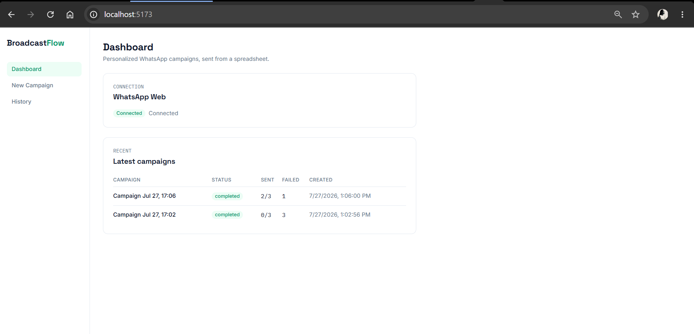
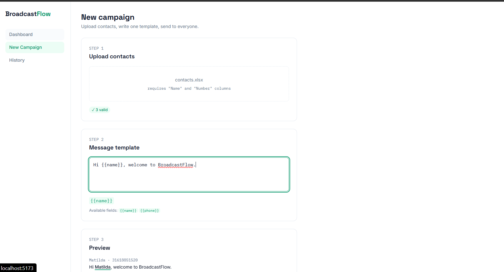
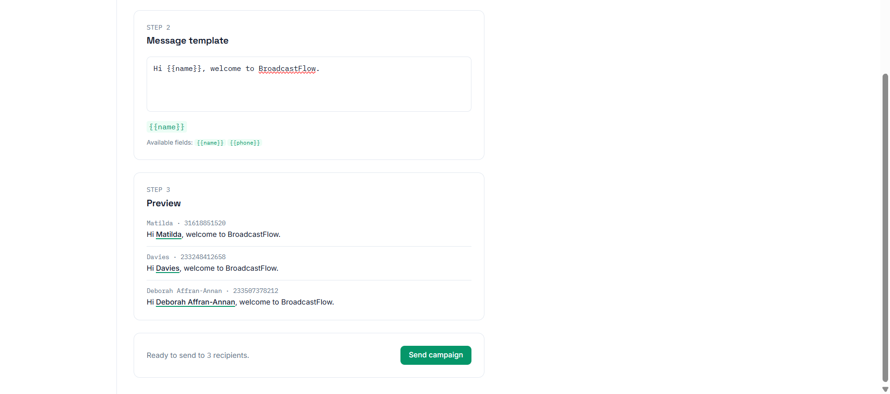
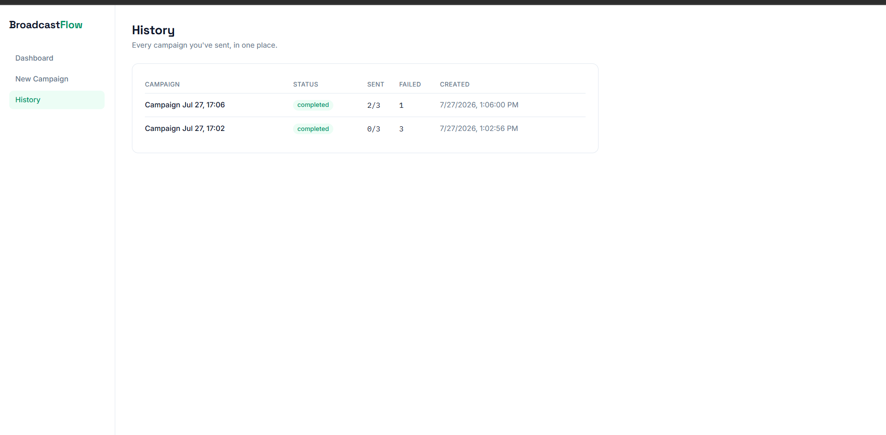

# BroadcastFlow

> Personalized WhatsApp campaign management for small businesses, churches, student organizations, and community groups.



## Why I Built It

I noticed that many organizations rely on WhatsApp to communicate with their communities, but sending personalized messages at scale is tedious. Existing tools either require manually copying and pasting messages or are built for enterprise marketing teams with pricing and complexity that don't fit smaller groups.

I wanted to explore whether a simple, focused tool could make personalized communication feel effortless while remaining transparent and easy to use.

## Problem

Sending personalized WhatsApp messages to a few hundred people — a church announcement, a small business promo, a student org update — usually means either copy-pasting the same message by hand, or reaching for tools that assume you're an enterprise marketing team with a budget to match.

## Solution

BroadcastFlow takes a spreadsheet of contacts and one message template with `{{name}}`-style placeholders, and turns it into a previewable, trackable WhatsApp campaign — no ads platform, no per-message fee, no account setup beyond your own WhatsApp.

## Features

### Upload contacts

Supports CSV/Excel uploads with validation and Live preview of message

 


### Track campaign progress

View successful and failed deliveries after sending.



## Technical Decisions

```
backend/    FastAPI, one service per responsibility (csv/template/whatsapp/campaign)
frontend/   React + TypeScript + Tailwind, TanStack Query, React Router
```

The backend drives WhatsApp Web directly through a real, logged-in browser session (via Selenium) rather than an unofficial API wrapper — WhatsApp has no public API for this, and the paid Business API is a different product with a different setup. That means:

- **The first run needs a one-time QR code scan**, same as opening WhatsApp Web in a browser normally.
- Sends go through WhatsApp's own "click to chat" link (`web.whatsapp.com/send?phone=...`) rather than driving the search box, which is the more stable of the two approaches since it doesn't depend on WhatsApp's search UI staying the same.

There's no database, authentication, or task queue by design — campaigns live in memory for the life of the server process. That's a deliberate scope cut for a tool meant to run on one person's machine for one person's contact list, not a missing feature.

## Running it

**Backend**
```bash
cd backend
cp .env.example .env
pip install -r requirements.txt
uvicorn app.main:app --reload
```

**Frontend**
```bash
cd frontend
npm install
npm run dev
```

Then open the frontend (default `http://localhost:5173`), connect WhatsApp from the Dashboard, and start a campaign.

## Future improvements

- Persist campaigns to a lightweight database so history survives a server restart
- Scheduling (send later, not just send now)
- Multi-recipient batching with backoff if WhatsApp rate-limits a session
- Swap Selenium for the official WhatsApp Business API for teams that want that tradeoff

## Lessons learned

The original version of this project drove WhatsApp Web by clicking through its search UI, which broke easily since it depended on exact DOM structure. Switching to WhatsApp's own deep-link scheme removed an entire class of fragile selectors, and made it obvious which parts of the automation are inherently fragile (the message box selector) versus avoidable (everything upstream of it). But more importantly, I learned that good automation isn't about clicking buttons faster—it's about reducing the number of assumptions your software makes about systems you don't control.
